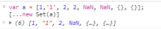
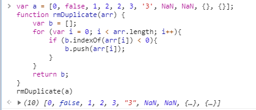
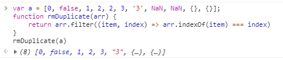
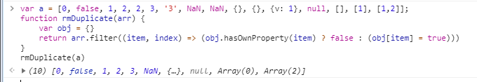
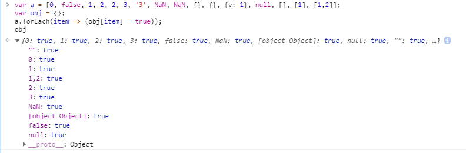
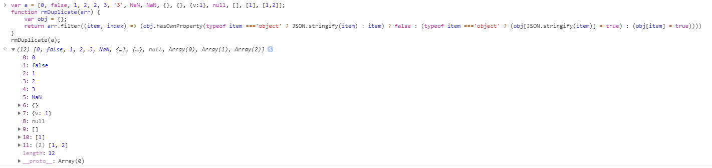

### 前言

最近一段时间项目中都没写到Vue和ES6，对ES6的部分内容已经有点生疏，最近项目进测试阶段终于有点时间翻看之前写关于ES6的笔记。ES6中的`Set`可以数组去重，当时便总结了几种去重的方法，现重新整理补充成此文章。

### new Set

第一种当然是`new Set()`，只用一行代码便能实现数组去重

```
var unique = (a) => [...new Set(a)];
```

这里有几点需要注意，先上图：



- Set本身是一个构造函数，用来生成Set数据结构（个人觉得可认为一种对象，如`{1, 2, 3}`），因而返回的不是数组，不能直接拿来当数组使用，将伪数组或类似数组的对象转换为数组的方式有多种方式，这里介绍两种，其余的在以后的文章做总结。

    > 前置条件：`var set = new Set([1,1,2,3]);`

    > `[...set]`
    
    > `Array.from(set)`

- Set函数可以接受一个数组/伪数组/类似数组的对象，作为参数
- Set内部判断是否相同使用的算法类似于`===`，唯一不同的地方是`NaN`(`NaN`不等于自身，但在Set中两个`NaN`是相等的)，所以图中**1和'1'不等**，**{}和{}不等**
- 其他Set实例的属性和方法参见阮一峰老师的[ES6标准入门](http://es6.ruanyifeng.com/)第13章第一节
- 优劣：
    > 优点：代码量少，可以判断NaN

    > 缺点：ES6，兼容性差

### indexOf



- `indexOf`内部使用使用的`===`进行判断
- 这里的for循环也可以改为`foreach()`
- 优劣：
    > 优点：兼容性好

    > 缺点：不能判断NaN的情况，`a.indexOf(NaN)`永远等于-1

### indexOf结合filter



- 如果是重复的元素，indexOf和下标是不相等的，可通过此处来判断
- 优劣：
    > 优点：写法简洁，兼容性好

    > 缺点：所有的NaN元素会被去除

### 对象



- 对象的键值都是**字符串**，而且对象不会存在两个相同的键值，以此可以来实现去重
- 数组元素作为对象属性时候，会隐形转换为字符串，相当于调用了`toString()`函数，对象无论是否有属性，都转换为`[object Object]`，但是数组特殊。如下：

    ```
    Array.prototype.toString.call([])    // ""
    Array.prototype.toString.call([1])     // "1" 和字符串"1"重复
    Array.prototype.toString.call([1,2])    // "1,2"
    Object.prototype.toString.call({})   // "[object Object]"
    Object.prototype.toString.call({a: 1})  // "[object Object]" 和上一条重复
    ```

- 虽然`typeof null === 'object'`为true，但是这里只是转换为字符串，所以转换后为字符串'null'

    

- 优劣：
    > 优点：NaN可判断，兼容性好
    
    > 缺点：数组和字符串无法区分，不适用于数组和对象去重

### 改进版对象处理



- 鉴于上述单个元素的数组会和字符串数值发生重复，所有除数组的对象发生重复，添加typeof进行判断区别
- 数值和字符串之间的区分还是存在问题
- 优劣：
    > 优点：NaN可判断，空对象可判断，可用于对象数组去重

    > 缺点：逻辑稍复杂，字符串数值还是不能判断

### 最后

对象处理的改进版中数值和字符串其实还可以通过typeof来进行进一步的判断，但是已经变得更复杂。在实际的代码中应根据实际情况进行选择方案。